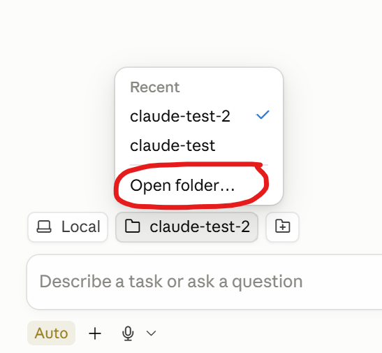
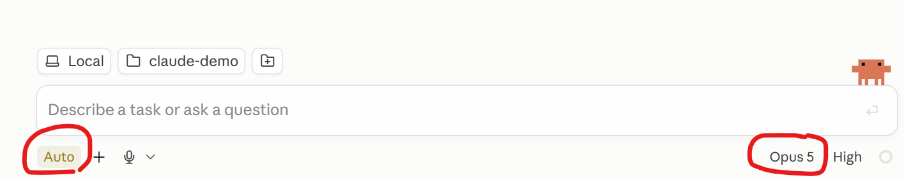
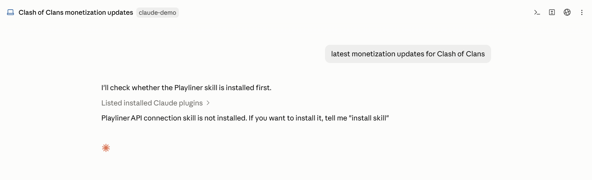
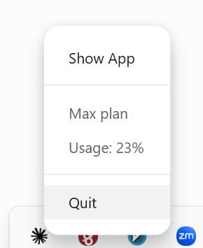

# How to use Playliner with Claude Desktop

Claude Desktop and the Claude CLI share the same environment, so you only need to
install the plugin once — it then works in both.

1. Create a new empty folder and download [`CLAUDE.md`](./user-local-instructions/claude/CLAUDE.md) into it.
2. Run Claude Desktop.
3. Open the folder containing the downloaded `CLAUDE.md` file.

   

4. Check the Claude setup: permission mode (Auto mode is recommended) and model.

   

5. Ask your question about mobile games — e.g. *"Latest monetization updates for Clash of Clans"*.

## First run

1. On the first run the agent offers to install the skill.

   

2. Answer "install skill" and Claude Desktop installs it for you.
3. After the skill is installed, restart Claude Desktop (choose `Quit`, then open it again).

   

4. Now you can ask your question.

On first use the skill asks for your Playliner API token — you can find it on the
[API settings page](https://app.sensortower.com/users/edit/api-settings).
